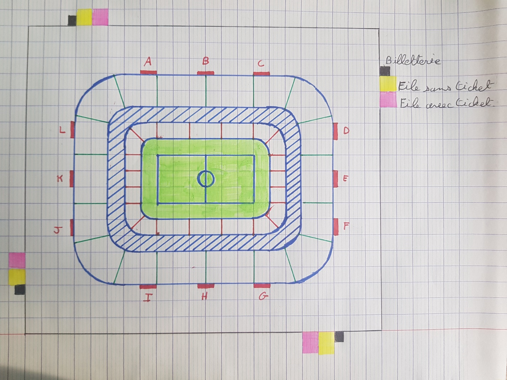

# StadiumSimulator

This project aims to simulate the crowd population in a stadium using multi-agent paradigm.

## To do
- Environment
- Spectator entrance
- Half time
- End of the game
- Interface

### Environment

